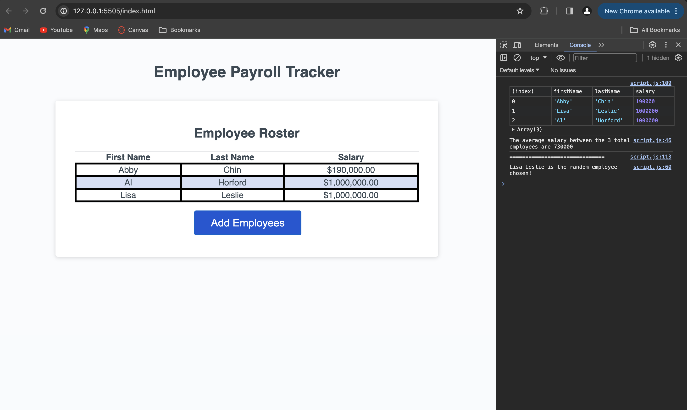

# payroll-data-manager

## Description 
This project utilizes the programming languages of Javascript to add logic to a webpage crafted using HTML and styled using CSS. This webpage actively updates to reflect changes made within a company's employment database. It allows the user to add new employee information including: first name, last name, and salary, and displays to the user this information in the form of a table. This webpage also returns the average salary across the company, as well as it selects and displays a random employee to the console.

## Usage

https://classja.github.io/payroll-data-manager/

## Credits 
Sought out assistance from the websites and resources listed below: 
- [x] https://teamtreehouse.com/community/uncaught-referenceerror-isnan-is-not-defined
- [x] AskBCS
- [x] https://developer.mozilla.org/en-US/docs/Web/JavaScript/Reference/Global_Objects/isNaN
- [x] https://www.tutorialspoint.com/How-to-concatenate-multiple-string-variables-in-JavaScript#:~:text=join()%20Method-,Using%20the%20%2B%20or%20%24%20(template%20literal)%20Operators,simply%20merges%20the%20two%20strings.
- [x] https://www.freecodecamp.org/news/how-to-convert-a-string-to-a-number-in-javascript/
- [x] https://stackoverflow.com/questions/29544371/finding-the-average-of-an-array-using-js

## License 
MIT